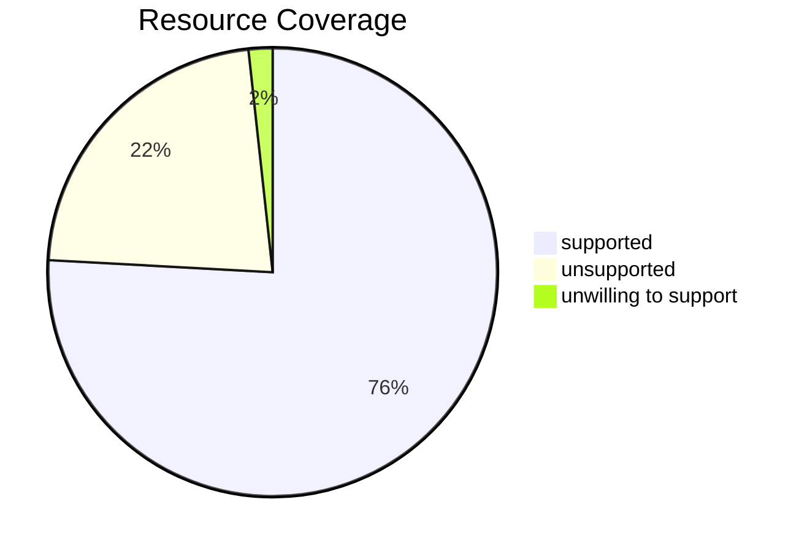

# Coverage

### api

| resource | status |
| --- | --- |
| componentstatuses | ⚪ |
| configmaps | 🟢 |
| endpoints | 🔴 |
| events | 🟢 |
| limitranges | 🟢 |
| namespaces | 🟢 |
| nodes | 🟢 |
| persistentvolumeclaims | 🟢 |
| persistentvolumes | 🟢 |
| pods | 🟢 |
| podtemplates | 🟢 |
| replicationcontrollers | ⚪ |
| resourcequotas | 🟢 |
| secrets | 🟢 |
| serviceaccounts | 🟢 |
| services | 🟢 |

### apiregistration.k8s.io

| resource | status |
| --- | --- |
| apiservices | 🟢 |

### apps

| resource | status |
| --- | --- |
| controllerrevisions | 🟢 |
| daemonsets | 🟢 |
| deployments | 🟢 |
| replicasets | 🟢 |
| statefulsets | 🟢 |

### autoscaling

| resource | status |
| --- | --- |
| horizontalpodautoscalers | 🟢 |

### batch

| resource | status |
| --- | --- |
| cronjobs | 🟢 |
| jobs | 🟢 |

### certificates.k8s.io

| resource | status |
| --- | --- |
| certificatesigningrequests | ⚪ |

### networking.k8s.io

| resource | status |
| --- | --- |
| ingressclasses | 🟢 |
| ingresses | 🟢 |
| ipaddresses | 🟢 |
| networkpolicies | 🟢 |
| servicecidrs | 🟢 |

### policy

| resource | status |
| --- | --- |
| poddisruptionbudgets | 🟢 |

### rbac.authorization.k8s.io

| resource | status |
| --- | --- |
| clusterrolebindings | 🟢 |
| clusterroles | 🟢 |
| rolebindings | 🟢 |
| roles | 🟢 |

### storage.k8s.io

| resource | status |
| --- | --- |
| csidrivers | 🟢 |
| csinodes | ⚪ |
| csistoragecapacities | ⚪ |
| storageclasses | 🟢 |
| volumeattachments | 🟢 |
| volumeattributesclasses | 🟢 |

### admissionregistration.k8s.io

| resource | status |
| --- | --- |
| mutatingwebhookconfigurations | ⚪ |
| validatingadmissionpolicies | ⚪ |
| validatingadmissionpolicybindings | ⚪ |
| validatingwebhookconfigurations | ⚪ |

### apiextensions.k8s.io

| resource | status |
| --- | --- |
| customresourcedefinitions | 🟢 |

### scheduling.k8s.io

| resource | status |
| --- | --- |
| priorityclasses | 🟢 |

### coordination.k8s.io

| resource | status |
| --- | --- |
| leases | ⚪ |

### node.k8s.io

| resource | status |
| --- | --- |
| runtimeclasses | 🟢 |

### discovery.k8s.io

| resource | status |
| --- | --- |
| endpointslices | 🟢 |

### resource.k8s.io

| resource | status |
| --- | --- |
| deviceclasses | 🟢 |
| resourceclaims | ⚪ |
| resourceclaimtemplates | 🟢 |
| resourceslices | ⚪ |

### flowcontrol.apiserver.k8s.io

| resource | status |
| --- | --- |
| flowschemas | 🟢 |
| prioritylevelconfigurations | 🟢 |