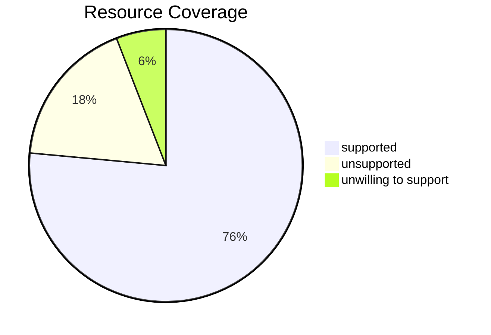
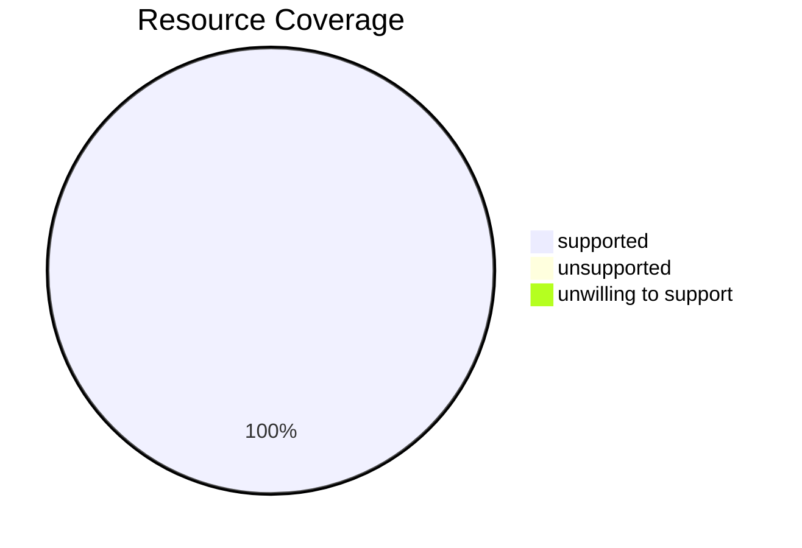
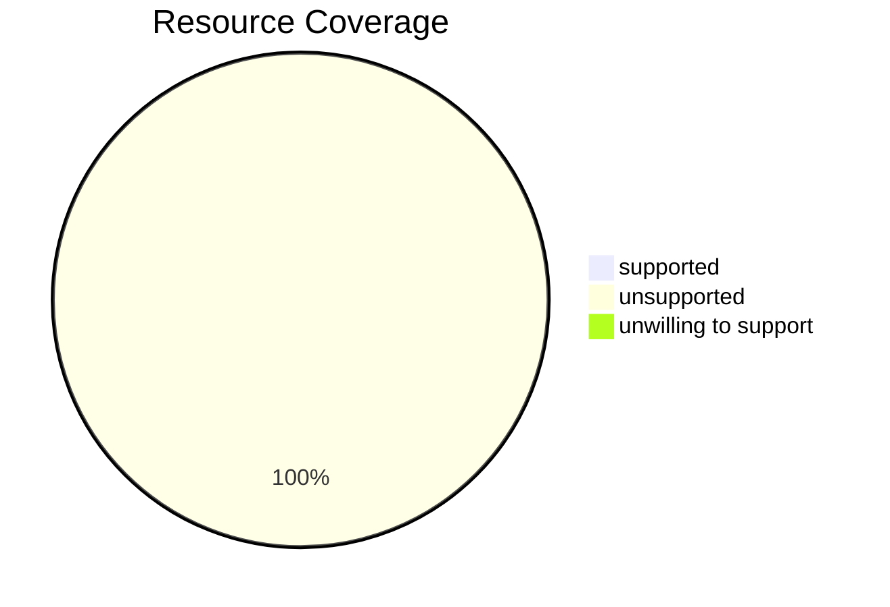
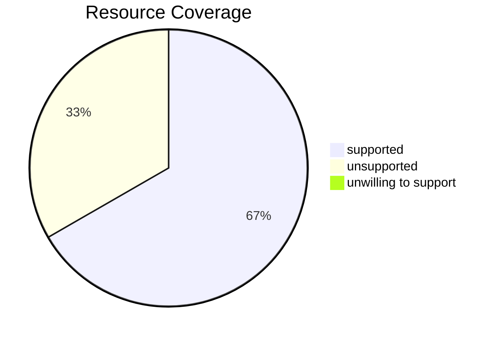
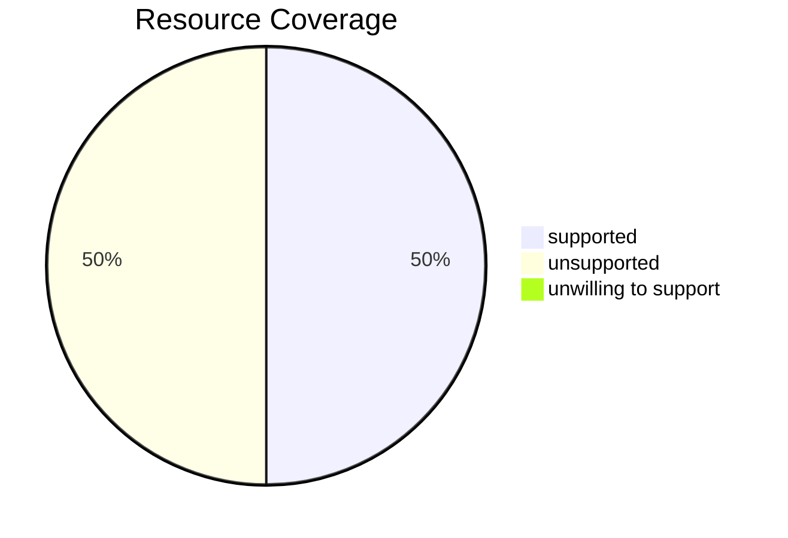

# Coverage

### api

| Resource       | Status |
|-----------------|--------|
| componentstatuses     | ⚪     |
| configmaps     | 🟢     |
| endpoints     | 🔴    |
| events     | 🟢     |
| limitranges     | 🟢     |
| namespaces     | 🟢     |
| nodes     | 🟢     |
| persistentvolumeclaims     | 🟢     |
| persistentvolumes     | 🟢     |
| pods     | 🟢     |
| podtemplates     | 🟢     |
| replicationcontrollers     | ⚪     |
| resourcequotas     | 🟢     |
| secrets     | 🟢     |
| serviceaccounts     | 🟢     |
| services     | 🟢     |
### apiregistration.k8s.io

| Resource       | Status |
|-----------------|--------|
| apiservices     | 🟢     |
### apps

| Resource       | Status |
|-----------------|--------|
| controllerrevisions     | 🟢     |
| daemonsets     | 🟢     |
| deployments     | 🟢     |
| replicasets     | 🟢     |
| statefulsets     | 🟢     |
### autoscaling

| Resource       | Status |
|-----------------|--------|
| horizontalpodautoscalers     | 🟢     |
### batch

| Resource       | Status |
|-----------------|--------|
| cronjobs     | 🟢     |
| jobs     | 🟢     |
### certificates.k8s.io

| Resource       | Status |
|-----------------|--------|
| certificatesigningrequests     | ⚪     |
### networking.k8s.io

| Resource       | Status |
|-----------------|--------|
| ingressclasses     | 🟢     |
| ingresses     | 🟢     |
| ipaddresses     | 🟢     |
| networkpolicies     | 🟢     |
| servicecidrs     | 🟢     |
### policy

| Resource       | Status |
|-----------------|--------|
| poddisruptionbudgets     | 🟢     |
### rbac.authorization.k8s.io

| Resource       | Status |
|-----------------|--------|
| clusterrolebindings     | 🟢     |
| clusterroles     | 🟢     |
| rolebindings     | 🟢     |
| roles     | 🟢     |
### storage.k8s.io

| Resource       | Status |
|-----------------|--------|
| csidrivers     | 🟢     |
| csinodes     | ⚪     |
| csistoragecapacities     | ⚪     |
| storageclasses     | 🟢     |
| volumeattachments     | 🟢     |
| volumeattributesclasses     | 🟢     |
### admissionregistration.k8s.io

| Resource       | Status |
|-----------------|--------|
| mutatingwebhookconfigurations     | ⚪     |
| validatingadmissionpolicies     | ⚪     |
| validatingadmissionpolicybindings     | ⚪     |
| validatingwebhookconfigurations     | ⚪     |
### apiextensions.k8s.io

| Resource       | Status |
|-----------------|--------|
| customresourcedefinitions     | 🟢     |
### scheduling.k8s.io

| Resource       | Status |
|-----------------|--------|
| priorityclasses     | 🟢     |
### coordination.k8s.io

| Resource       | Status |
|-----------------|--------|
| leases     | ⚪     |
### node.k8s.io

| Resource       | Status |
|-----------------|--------|
| runtimeclasses     | 🟢     |
### discovery.k8s.io

| Resource       | Status |
|-----------------|--------|
| endpointslices     | 🟢     |
### resource.k8s.io

| Resource       | Status |
|-----------------|--------|
| deviceclasses     | 🟢     |
| resourceclaims     | ⚪     |
| resourceclaimtemplates     | 🟢     |
| resourceslices     | ⚪     |
### flowcontrol.apiserver.k8s.io

| Resource       | Status |
|-----------------|--------|
| flowschemas     | 🟢     |
| prioritylevelconfigurations     | 🟢     |