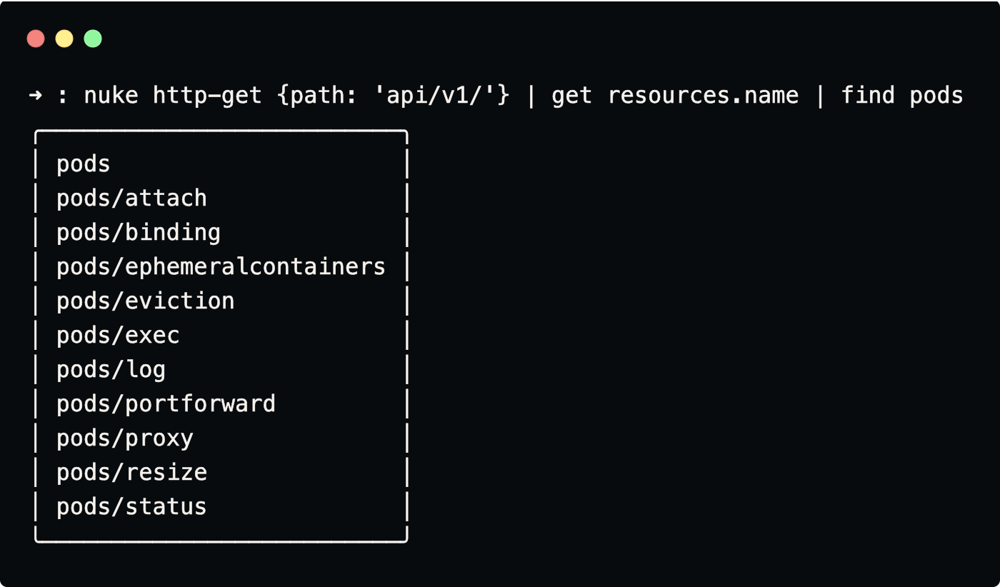

# Nuke

Nushell-native Kubernetes integration

<p align="center">
  
</p>

---

## Overview

Have you ever done something like
```nu
kubectl get po -o yaml | from yaml
kubectl get po | detect columns --guess
```
hoping you could simply query and inspect data from the kube API-server?  
You wish you could just `kubectl get po | sort-by age`? Me too.  

Nuke talks directly to the Kubernetes API server and returns **structured, typed, queryable objects**, so we can do things like:
```nu
nuke get po -o wide | group-by node
nuke get po | sort-by restarts
```

> Nuke tries to adhere the semantics of kubectl, integrating it with richer data.  
> At the same time it allows you to create custom formatters for your favourite resources and commands.

> Nuke does not aim to reimplement all of kubectl.  
> Instead, it targets those commands where structured data makes the difference.

> Nuke aims to provide a familiar environment by mimicking kubectl commands structure and behaviour.  
> Plus, all flags, resources and resource names support autocompletion.

### Implemented Commands

| Nuke Command           | kubectl Equivalent        |
|------------------------|---------------------------|
| `nuke get`             | `kubectl get`             |
| `nuke http-get`          | `kubectl get --raw`          |
| `nuke api-resources`   | `kubectl api-resources`   |
| `nuke api-versions`    | `kubectl api-versions`    |
| `nuke rollout status`  | `kubectl rollout status`  |
| `nuke rollout history` | `kubectl rollout history` |
| `nuke top`             | `kubectl top`             |
| `nuke config`          | `kubectl config`          |

---

## How Nuke Works

1. Reads your kubeconfig
2. Authenticates against the API server
3. Performs HTTP requests directly
4. Applies resource-specific formatter
5. Returns structured Nushell data

If no formatter is implemented, a default formatter is used.

### Installation

Clone this repository into one of your Nushell library directories (`$env.NU_LIB_DIRS`):
```nu
let random_lib_dir = ([($env.NU_LIB_DIRS | first) nuke] | path join)
git clone git@github.com:lassoColombo/nuke.git $random_lib_dir
```

Verify installation:
```nu
use nuke
nuke api-resources
```

#### Dependencies

- `curl` — used for HTTP communication with the API server

#### Configuration

Nuke uses your existing Kubernetes configuration:
```
$env.KUBECONFIG  (defaults to ~/.kube/config)
```
No additional setup required.

---

## Formatters

Commands that retrieve objects support three formats:

| Format      | Description                                                   |
|-------------|---------------------------------------------------------------|
| `compact`   | Similar to `kubectl get` |
| `wide`      | Similar to `kubectl describe`                              |
| `full`      | Complete object returned by the Kubernetes API server         |


The compact format is the default when retrieving a list of objects, while wide is the default for single objects.

> Nuke is currently under active development, so not all resources have a dedicated formatter yet.  
> When a specific formatter isn’t available, Nuke automatically falls back to the default formatter.

### Custom Formatters

Formatters control how Kubernetes objects are displayed.

You can override or define custom formatters using environment variables:

- `NUKE_RESOURCE_FORMATTERS`
- `NUKE_ROLLOUTSTATUS_FORMATTERS`
- `NUKE_METRIC_FORMATTERS`

Example:

```nu
$env.NUKE_RESOURCE_FORMATTERS = {
  apps: { # api group (see 'nuke api-versions -o wide | get name')
    v1: { # api version (see 'nuke api-versions')
      deployments: {|output?: string = compact| # resource object (see 'nuke api-resources | get name')
        let obj = $in
        let res = {
          name: $obj.metadata.name
          namespace: $obj.metadata.namespace
          containers: ($obj.spec.template.spec.containers | length)
        }
        if $output == compact {
          return ($res
            | insert containers ($obj.spec.template.spec.containers | length)
          )
        }
        $res 
        | insert containers $obj.spec.template.spec.containers
      }
    }
  }
}
```

---

## Nuke Http-Get
The http-get method performs an authenticated request to the kube API-server and returns the result as structured data without performing any additional parsing. The request url must be specified as a record as expected by [url-join](https://www.nushell.sh/commands/docs/url_join.html), which will be merged with the spec present in the kubeconfig
```nu
nuke http-get {path: api/v1}
```

<p align="center">
  
</p>


---

## Nuke Config

Nuke provides utilities to manage kubeconfig contexts and namespaces.

##### Switch namespace

```nu
nuke config switch-namespace my-namespace
# If no argument is provided, you will be prompted to choose one in the builtin fuzzyfinder
```

##### Switch context

```nu
nuke config switch-context my-context
# If no argument is provided, you will be prompted to choose one in the builtin fuzzyfinder
```

##### Additional helpers:
```nu
nuke config get-contexts
nuke config get-clusters
nuke config get-users
nuke config edit
nuke config
```

---

## Authentication

Supported authentication methods:

- Token-based credentials
- Client certificate authentication

Planned support:

- OIDC

---

## Contributing

Contributions, bug reports, and feature requests are welcome.

Before opening an issue or pull request, please read: [CONTRIBUTING.md](CONTRIBUTING.md)

The contributing guide includes:

- Development setup
- How to reproduce bugs
- KIND cluster configuration
- Metrics server setup
- Formatter development guidelines

---

## Roadmap

- Improve coverage of built-in resource formatters
- Implement `nuke describe` command
- Additional authentication methods
  - OIDC
  - Exec plugins
- Watch functionality
