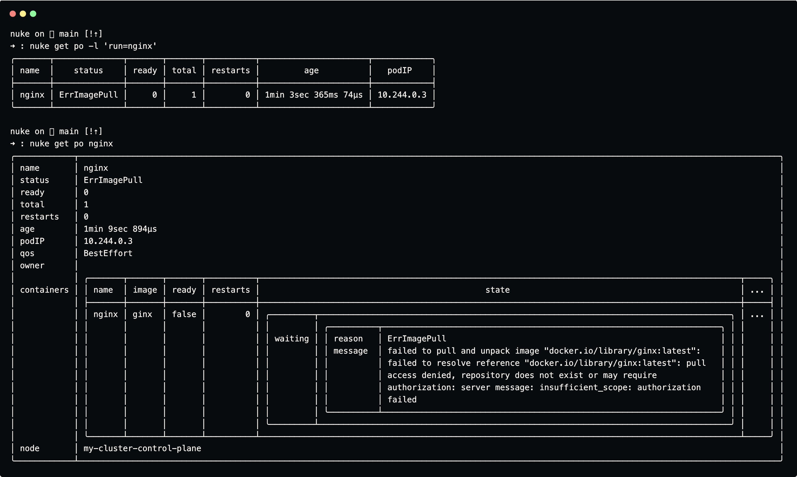
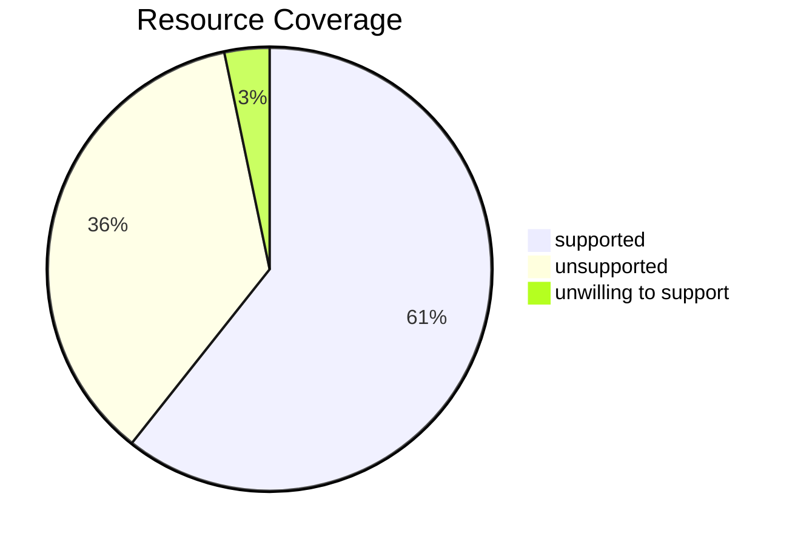

# Nuke
A Nushell-native Kubectl-get

<p align="center">
  
</p>

---

**Nuke** natively brings Kubernetes resource inspection to [Nushell](https://www.nushell.sh/).  
It exposes kubectl-like commands that query the Kubernetes API-Server and return results the Nushell way.

Nuke **aims** to return data that is:
- Structured
- Queryable
- Typed

> Nuke does **not** aim to **exactly replicate `kubectl`**. \
Instead, it provides a **Nushell-native experience**, returning structured and often richer data.

> Nuke does **not** aim to **reimplement all of `kubectl`**. \
Instead, it focuses on those commands where Nushell’s structured data provides the most value.

---

Currently implemented:
| Command                | Equivalent of         |
|------------------------|-----------------------|
| `nuke show`            | `kubectl get`         |
| `nuke api resources`   | `kubectl api-resources` |
| `nuke api versions`    | `kubectl api-versions` |
| `nuke switch`            | `kubectl config set-context --current`         |
| `nuke cfg`            | `kubectl config`         |


### Nuke Show
Shows kubernetes resources.

The `nuke show` command supports three output formats:

| Format | Description |
|---------|-------------|
| **compact** | Similar to `kubectl get <resource>` |
| **wide** | Similar to `kubectl get <resource> -o wide` |
| **full** | Returns the complete objects as presented by the API server. |

The **compact** format is the default when retrieving a list of objects, while **wide** is the default for single objects.  
All flags, resources and resource names support autocompletion.

> **Note:** Nuke is under active development.
> Not all resources currently support `compact` and `wide` formats — when unavailable, Nuke falls back to `full`.

### Nuke Switch
Switch current-context and current-namespace using nushell input and autoocmpletion functionalities.

This module provides functionalities equivalent to [kubectl-ns](https://github.com/weibeld/kubectl-ns) and [kubectl-ctx](https://github.com/weibeld/kubectl-ctx): it allows to switch context and namespace either by providing a target context or by selecting one in the builtin fuzzy finder.

## Installation

Clone this repository into one of your `$env.NU_LIB_DIRS`:
```nu
git clone git@github.com:lassoColombo/nuke.git ([($env.NU_LIB_DIRS | first) nuke] | path join)
```

Run your first commands:
```nu
use nuke
nuke api resources
# The first run might take a while as Nuke scans the cluster to collect the list of supported API resources.
```

Then, start exploring:

```nu
alias kk = nuke show

kk po
kk po --show-labels
kk po a-po
kk po a-po --show-conditions
kk po a-po --o full
kk po --all
```

#### Update Nuke
```nu
cd ([($env.NU_LIB_DIRS | first) nuke] | path join) # or wherever you cloned nuke
git pull
```

### Dependencies

Nuke is designed to be as **Nushell-native** as possible. \
However, until the Nushell http-client provides all needed authentication functionalities, a few external tools are used:
- **curl** — soemtimes used for direct HTTP calls to the Kubernetes API server

### Configuration
Nuke uses your existing Kubernetes configuration (`$env.KUBECONFIG`, usually `~/.kube/config`). \
No additional setup is required.

Optionally, you can define a short alias for the `show` command:
```nu
alias kk = nuke show
```

#### Directory Specification
Nuke adheres to the [XDG Directory Specification](https://specifications.freedesktop.org/basedir-spec/latest/):
- cache lives in `($env.XDG_CACHE_HOME? | default ([$env.HOME .cache] | path join))`

## Authentication
Nuke reads `$env.KUBECONFIG` to determine the active context and authentication method, then uses those credentials to perform direct HTTP calls to the API server.

Currently supported authentication methods:

- Token-based (hardcoded in kubeconfig)
- Certificate-based (hardcoded in kubeconfig)

Planned:

- OIDC
- Exec plugins

---

## Contributing

Contributions, bug reports, and feature requests are truly welcome.
Please open an issue or pull request if you’d like to help improve Nuke.

#### working on Nuke

1) If you have a cluster and kubectl can access it, so can nuke (as long as the authentication method to the cluster is supported). \
   If you do not have a cluster you can kindly create it: `kind create cluster --name my-cluster`
2) `use nuke`
3) `nuke show <my-unsupported-resource>`
3) `nuke show <my-unsupported-resource> | my-custom-formatter -o [wide|compact]` until you are happy with your formatter

## Roadmap

- [ ] Implement compact and wide formatters for the standard resources
- [ ] Extend `nuke show`:
  - [ ] Implement `--watch` flag
  - [ ] Support the `all` pseudo-resource (`nuke show all -n kube-system`)
- [ ] Implement `nuke describe` command?
- [ ] Implement additional authentication methods:
  - [ ] OIDC
  - [ ] Exec plugins

# Resources Implementation Status

### Coverage



### List

| Resource       | Status |
|-----------------|--------|
| apiservices     | 🟢     |
| certificatesigningrequests     | ⚪     |
| clusterrolebindings     | 🟢     |
| clusterroles     | 🟢     |
| componentstatuses     | 🔴    |
| configmaps     | 🟢     |
| controllerrevisions     | 🟢     |
| cronjobs     | 🟢     |
| csidrivers     | ⚪     |
| csinodes     | ⚪     |
| csistoragecapacities     | ⚪     |
| customresourcedefinitions     | 🟢     |
| daemonsets     | 🟢     |
| deployments     | 🟢     |
| deviceclasses     | 🟢     |
| endpoints     | 🔴    |
| endpointslices     | 🟢     |
| events     | 🟢     |
| events     | 🟢     |
| flowschemas     | 🟢     |
| horizontalpodautoscalers     | ⚪     |
| horizontalpodautoscalers     | ⚪     |
| ingressclasses     | 🟢     |
| ingresses     | 🟢     |
| ipaddresses     | 🟢     |
| jobs     | 🟢     |
| leases     | ⚪     |
| limitranges     | 🟢     |
| mutatingwebhookconfigurations     | ⚪     |
| namespaces     | 🟢     |
| networkpolicies     | 🟢     |
| nodes     | 🟢     |
| persistentvolumeclaims     | 🟢     |
| persistentvolumes     | 🟢     |
| poddisruptionbudgets     | 🟢     |
| pods     | 🟢     |
| podtemplates     | 🟢     |
| priorityclasses     | 🟢     |
| prioritylevelconfigurations     | ⚪     |
| replicasets     | 🟢     |
| replicationcontrollers     | ⚪     |
| resourceclaims     | ⚪     |
| resourceclaimtemplates     | 🟢     |
| resourcequotas     | 🟢     |
| resourceslices     | ⚪     |
| rolebindings     | 🟢     |
| roles     | 🟢     |
| runtimeclasses     | ⚪     |
| secrets     | 🟢     |
| serviceaccounts     | 🟢     |
| servicecidrs     | 🟢     |
| services     | 🟢     |
| statefulsets     | 🟢     |
| storageclasses     | ⚪     |
| validatingadmissionpolicies     | ⚪     |
| validatingadmissionpolicybindings     | ⚪     |
| validatingwebhookconfigurations     | ⚪     |
| volumeattachments     | ⚪     |
| volumeattributesclasses     | ⚪     |
