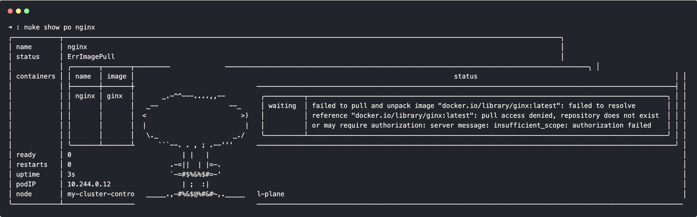

# Nuke
*A Nushell-native `kubectl get`*

<p align="center">
  
</p>

---
# Index

- [Overview](#overview)
- [Installation](#installation)
- [Dependencies](#dependencies)
- [Configuration](#configuration)
- [Output](#output)
- [Authentication](#authentication)
- [Roadmap](#roadmap)
- [Contributing](#contributing)
- [Resources Implementation Status](#resources-implementation-status)
- [License](#license)

---

## Overview

**Nuke** aims to bring Kubernetes resource inspection to [Nushell](https://www.nushell.sh/) natively — without using `kubectl`. \
It implements Nushell commands equivalent to the various `kubectl` commands that retrieve data from the Kubernetes API server.

Currently implemented:

- `nuke show` — equivalent of `kubectl get`
- `nuke api resources` — equivalent of `kubectl api-resources`
- `nuke api versions` — equivalent of `kubectl api-versions`

---

## Installation

Clone this repository into one of your `$env.NU_LIB_DIRS`:

```nu
git clone git@github.com:lassoColombo/nuke.git ([($env.NU_LIB_DIRS | first) nuke] | path join)
```

Run your first commands:

```nu
use nuke
nuke api resources
# The first run might take a while as Nuke scans the cluster to collect the list of supported API resources.
# This data is cached under ~/.cache/nuke and can be refreshed manually by deleting that folder.
```

Then, start exploring:

```nu
nuke show po
nuke show po --show-labels
nuke show po a-po
nuke show po a-po --show-conditions
nuke show po a-po --o full
nuke show po --all
```

#### Update Nuke

```nu
cd ([($env.NU_LIB_DIRS | first) nuke] | path join) # or wherever you cloned nuke
git pull
```


### Dependencies

Nuke is designed to be as **Nushell-native** as possible. \
However, until the Nushell http-client provides all required authentication functionalities, a few external tools are used:
- **curl** — soemtimes used for direct HTTP calls to the Kubernetes API server


### Configuration

Nuke uses your existing Kubernetes configuration (`$env.KUBECONFIG`, usually `~/.kube/config`). \
No additional setup is required.

Optionally, you can define a short alias for the `show` command:

```nu
alias kk = nuke show
```

#### Directory Specification

Nuke adheres to the [XDG Directory Specification](https://specifications.freedesktop.org/basedir-spec/latest/):
- cache lives in `($env.XDG_CACHE_HOME? | default ([$env.HOME .cache] | path join))`

---

## Output

### Formats

The `nuke show` command supports three output formats:

| Format | Description |
|---------|-------------|
| **compact** | Similar to `kubectl get <resource>` |
| **wide** | Similar to `kubectl get <resource> -o wide` |
| **full** | Returns the complete objects as presented by the API server. This has no direct kubectl equivalent and can be seen as a combination of `kubectl get` and `kubectl describe`. |

The **compact** format is the default when retrieving a list of objects, while **wide** is the default for single objects.

> **Note:** Nuke is under active development.  
> Not all resources currently support `compact` and `wide` formats — when unavailable, Nuke falls back to `full`.
> If a resource is not yet supported feel free to look into fmt.nu and open a pull request (see the [Contributing](#contributing) section).

---

### Decorators

The `nuke show` command output can be decorated with additional information:

- `--show-labels` — include `metadata.labels`
- `--show-annotations` — include `metadata.annotations`
- `--show-conditions` — include `status.conditions`

---

### Differences from kubectl

Nuke does **not** aim to exactly replicate `kubectl`. \
Instead, it provides a **Nushell-native experience**, often returning more structured or richer data.

In general:  
> If `kubectl` shows it, Nuke will show it — and often more.

---

## Authentication

Nuke reads `$env.KUBECONFIG` to determine the active context and authentication method, then uses those credentials to perform direct HTTP calls to the API server.

Currently supported authentication methods:

- Token-based (hardcoded in kubeconfig)
- Certificate-based (hardcoded in kubeconfig)

Planned:

- OIDC
- Exec plugins

---

## Roadmap

- [ ] Implement compact and wide formatters for the standard resources
- [ ] Extend `nuke show`:
  - [X] Implement `--watch` flag
  - [ ] Support the `all` pseudo-resource (`nuke show all -n kube-system`)
- [ ] Implement `nuke describe` command?
- [ ] Implement additional authentication methods:
  - [ ] OIDC
  - [ ] Exec plugins

## Contributing

Contributions, bug reports, and feature requests are truly welcome.
Please open an issue or pull request if you’d like to help improve Nuke.

#### working on Nuke

1) If you have a cluster and kubectl can access it, so can nuke (as long as the authentication method to the cluster is supported). \
   If you do not have a cluster you can kindly create it: `kind create cluster --name my-cluster`
2) `use nuke`
3) `nuke show <my-unsupported-resource>`
3) `nuke show <my-unsupported-resource> | my-custom-formatter -o [wide|compact]` until you are happy with your formatter

# Resources Implementation Status

<details>
<summary><strong>api/v1</strong></summary>

| Resource | Status |
|-----------|--------|
| componentstatuses | ❌ |
| configmaps | ✅ |
| endpoints | ✅ |
| events | ✅ |
| limitranges | ⬜ |
| namespaces | ✅ |
| nodes | ✅ |
| persistentvolumeclaims | ✅ |
| persistentvolumes | ✅ |
| pods | ✅ |
| podtemplates | ⬜ |
| replicationcontrollers | ⬜ |
| resourcequotas | ⬜ |
| secrets | ✅ |
| serviceaccounts | ✅ |
| services | ✅ |

</details>

---

<details>
<summary><strong>apiregistration.k8s.io/v1</strong></summary>

| Resource | Status |
|-----------|--------|
| apiservices | ✅ |

</details>

---

<details>
<summary><strong>apps/v1</strong></summary>

| Resource | Status |
|-----------|--------|
| controllerrevisions | ✅ |
| daemonsets | ✅ |
| deployments | ✅ |
| replicasets | ✅ |
| statefulsets | ✅ |

</details>

---

<details>
<summary><strong>events.k8s.io/v1</strong></summary>

| Resource | Status |
|-----------|--------|
| events | ✅ |

</details>

---

<details>
<summary><strong>autoscaling/v1</strong></summary>

| Resource | Status |
|-----------|--------|
| horizontalpodautoscalers | ⬜ |

</details>

---

<details>
<summary><strong>autoscaling/v2</strong></summary>

| Resource | Status |
|-----------|--------|
| horizontalpodautoscalers | ⬜ |

</details>

---

<details>
<summary><strong>batch/v1</strong></summary>

| Resource | Status |
|-----------|--------|
| cronjobs | ✅ |
| jobs | ✅ |

</details>

---

<details>
<summary><strong>certificates.k8s.io/v1</strong></summary>

| Resource | Status |
|-----------|--------|
| certificatesigningrequests | ⬜ |

</details>

---

<details>
<summary><strong>networking.k8s.io/v1</strong></summary>

| Resource | Status |
|-----------|--------|
| ingressclasses | ⬜ |
| ingresses | ⬜ |
| ipaddresses | ✅ |
| networkpolicies | ✅ |
| servicecidrs | ✅ |

</details>

---

<details>
<summary><strong>policy/v1</strong></summary>

| Resource | Status |
|-----------|--------|
| poddisruptionbudgets | ⬜ |

</details>

---

<details>
<summary><strong>rbac.authorization.k8s.io/v1</strong></summary>

| Resource | Status |
|-----------|--------|
| clusterrolebindings | ✅ |
| clusterroles | ✅ |
| rolebindings | ✅ |
| roles | ✅ |

</details>

---

<details>
<summary><strong>storage.k8s.io/v1</strong></summary>

| Resource | Status |
|-----------|--------|
| csidrivers | ⬜ |
| csinodes | ⬜ |
| csistoragecapacities | ⬜ |
| storageclasses | ⬜ |
| volumeattachments | ⬜ |
| volumeattributesclasses | ⬜ |

</details>

---

<details>
<summary><strong>admissionregistration.k8s.io/v1</strong></summary>

| Resource | Status |
|-----------|--------|
| mutatingwebhookconfigurations | ⬜ |
| validatingadmissionpolicies | ⬜ |
| validatingadmissionpolicybindings | ⬜ |
| validatingwebhookconfigurations | ⬜ |

</details>

---

<details>
<summary><strong>apiextensions.k8s.io/v1</strong></summary>

| Resource | Status |
|-----------|--------|
| customresourcedefinitions | ⬜ |

</details>

---

<details>
<summary><strong>scheduling.k8s.io/v1</strong></summary>

| Resource | Status |
|-----------|--------|
| priorityclasses | ✅ |

</details>

---

<details>
<summary><strong>coordination.k8s.io/v1</strong></summary>

| Resource | Status |
|-----------|--------|
| leases | ⬜ |

</details>

---

<details>
<summary><strong>node.k8s.io/v1</strong></summary>

| Resource | Status |
|-----------|--------|
| runtimeclasses | ⬜ |

</details>

---

<details>
<summary><strong>discovery.k8s.io/v1</strong></summary>

| Resource | Status |
|-----------|--------|
| endpointslices | ✅ |

</details>

---

<details>
<summary><strong>resource.k8s.io/v1</strong></summary>

| Resource | Status |
|-----------|--------|
| deviceclasses | ⬜ |
| resourceclaims | ⬜ |
| resourceclaimtemplates | ⬜ |
| resourceslices | ⬜ |

</details>

---

<details>
<summary><strong>flowcontrol.apiserver.k8s.io/v1</strong></summary>

| Resource | Status |
|-----------|--------|
| flowschemas | ⬜ |
| prioritylevelconfigurations | ⬜ |

</details>

---
---

## License

[MIT](LICENSE)
